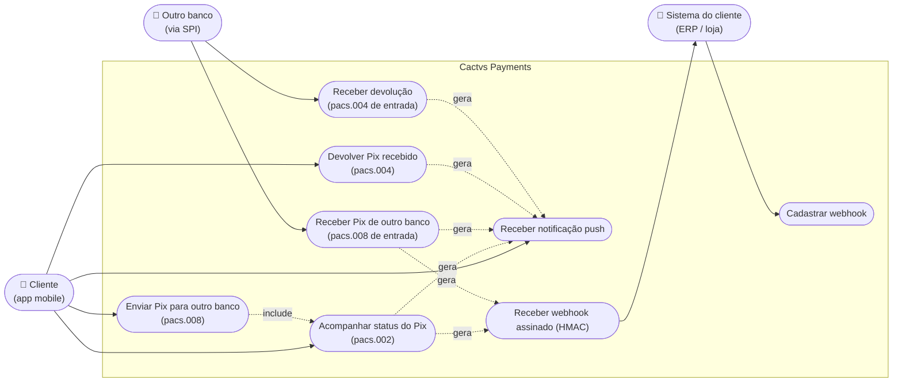
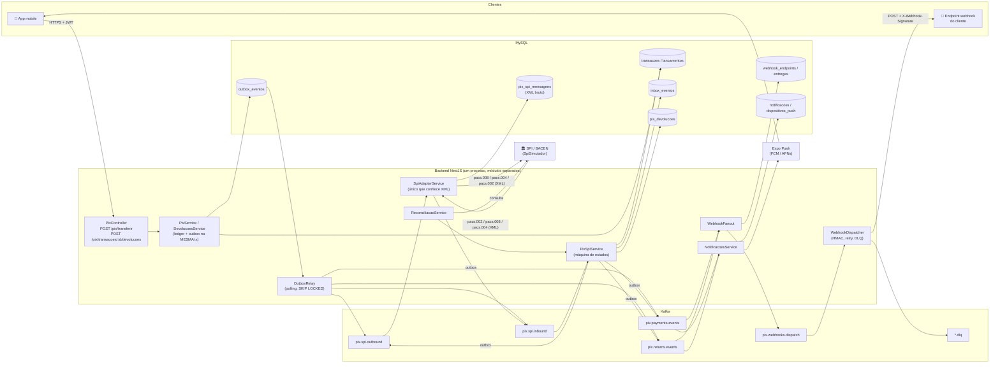
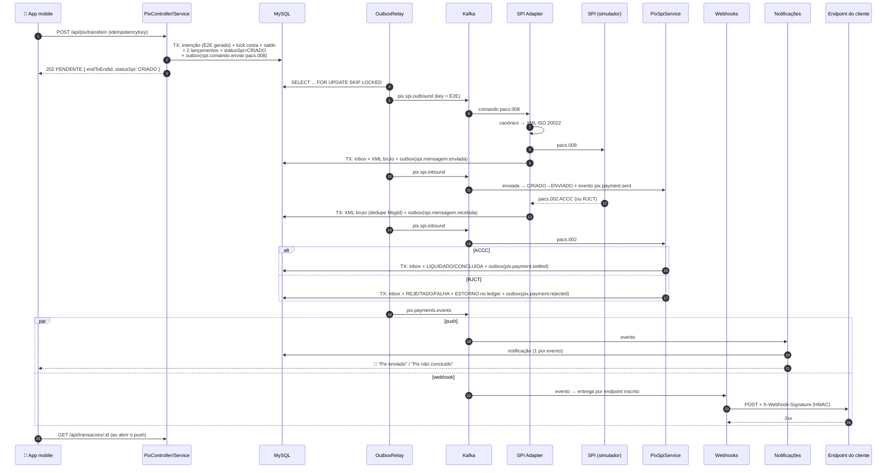
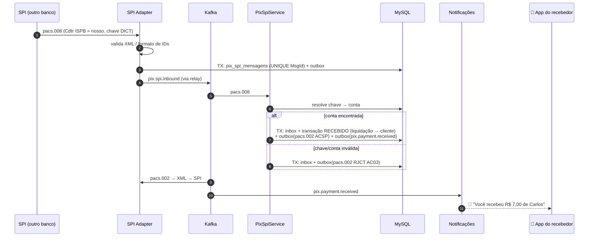
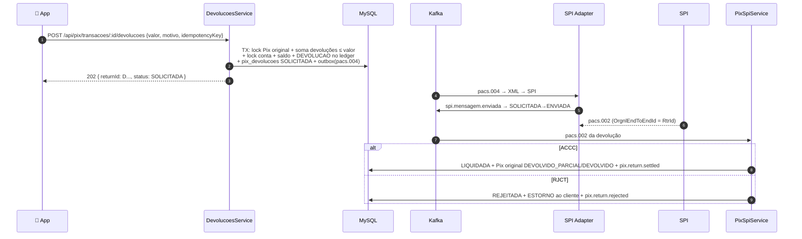
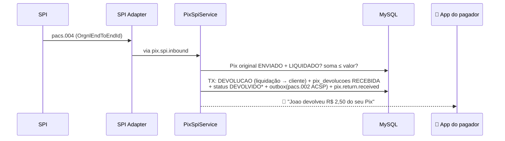
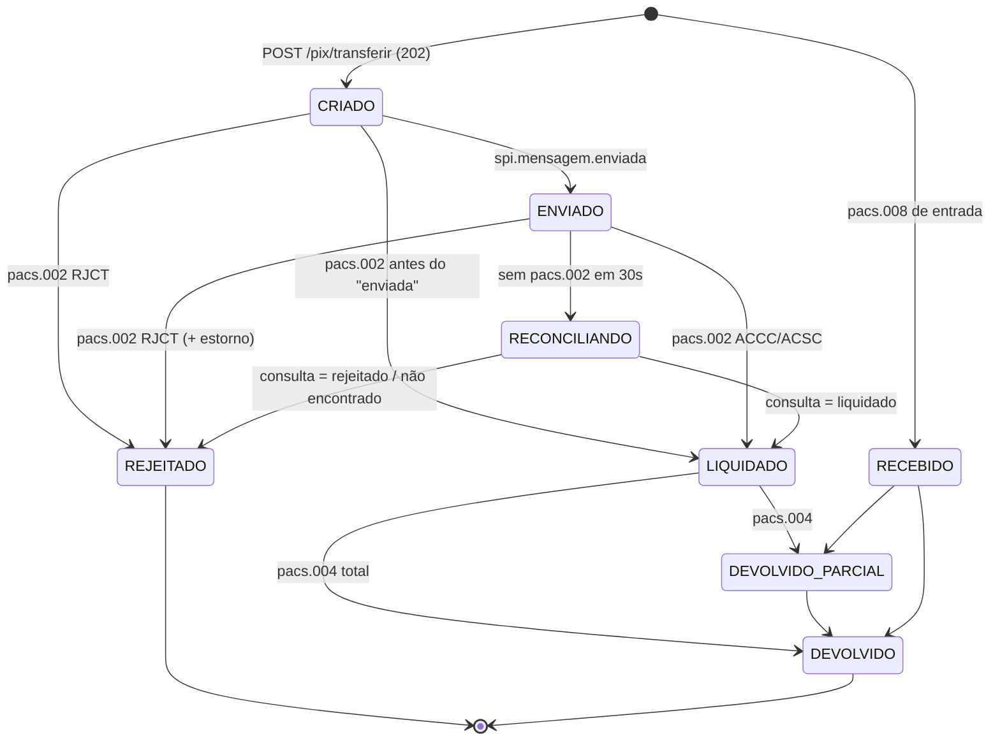
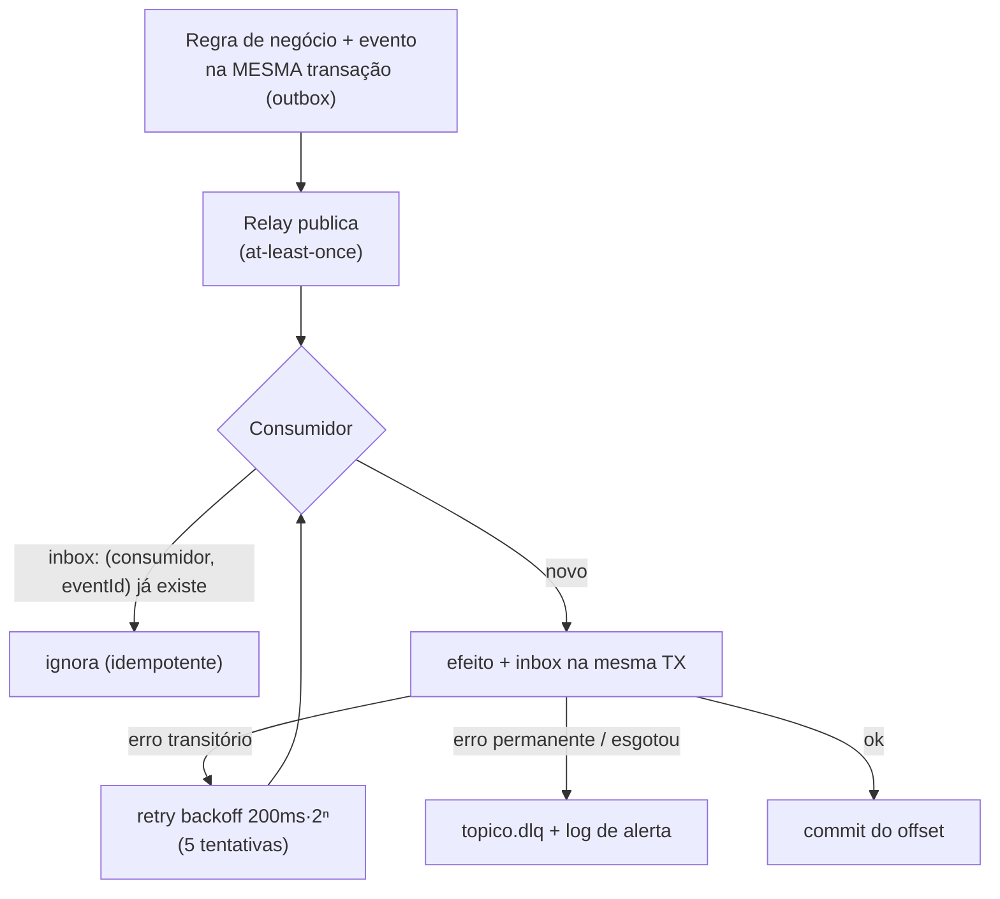
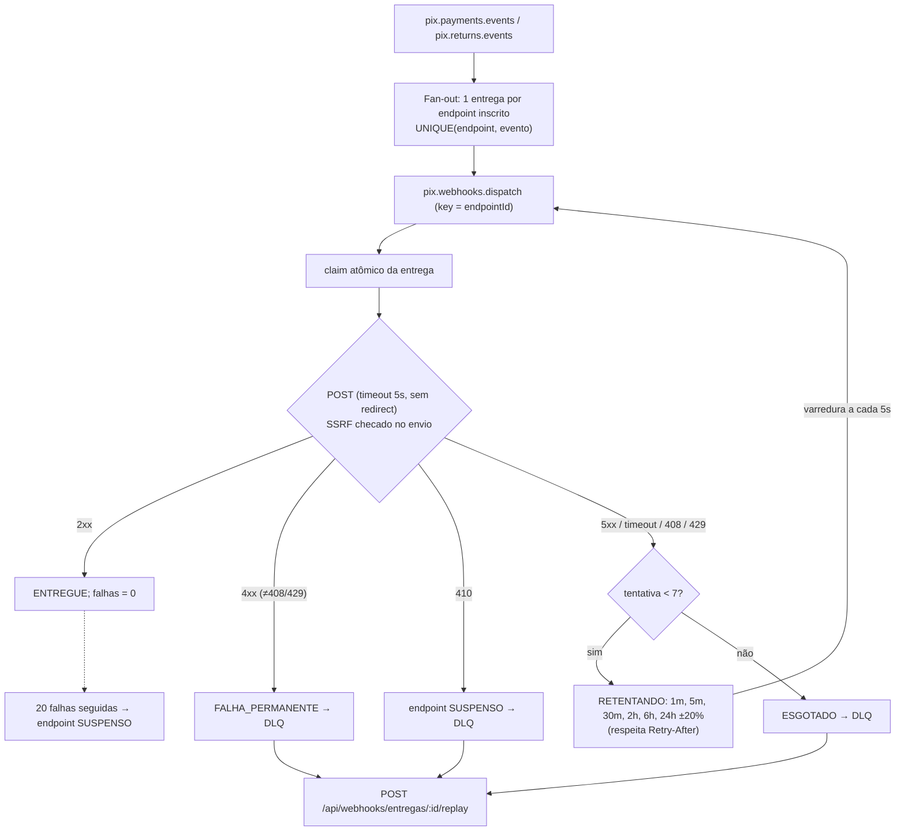

# Mensageria Pix — implementação (pacs.008 / pacs.002 / pacs.004 + Kafka + Webhooks + Push)

> Implementa o desenho de [`../../mensageria.md`](../../mensageria.md) sobre o backend
> existente (NestJS + Prisma + **MySQL 8**). Este documento descreve **o que foi
> construído**, como rodar e como o app mobile se integra.
>
> ⚠️ O SPI é **simulado**. XML ISO 20022 simplificado, sem XSD oficial, sem assinatura
> XMLDSig/ICP-Brasil e sem DICT real. Ver [§10](#10-o-que-falta-para-produção).

---

## 1. Caso de uso: cliente no app mobile



**Fluxo principal:** o app envia o Pix → recebe **202 PENDENTE** na hora (o valor já saiu
do saldo) → o `pacs.008` segue assíncrono pelo Kafka até o SPI → o `pacs.002` volta →
o status muda → o cliente recebe **push** no celular e o ERP recebe **webhook**.

---

## 2. Arquitetura implementada



### Onde está cada peça

| Pasta | Responsabilidade |
|---|---|
| `src/mensageria/` | `Barramento` (porta) com `BarramentoKafka` e `BarramentoMemoria`; `OutboxService`, `OutboxRelayService`, `InboxService`, `ConsumidorService` (retry + DLQ), tópicos e envelope |
| `src/spi/iso20022/` | Modelo canônico, codec XML ⇄ canônico (pacs.008/002/004), geração de `EndToEndId` / `ReturnId` / `MsgId` |
| `src/spi/` | `SpiGateway` (porta), `SpiSimulador`, `SpiAdapterService`, endpoints do simulador |
| `src/pix/` | `PixService` (envio), `DevolucoesService` (pacs.004 de saída), `eventos-pix.ts` (catálogo) |
| `src/pix/spi/` | `PixSpiService` (consome `pix.spi.inbound`), máquina de estados, ledger (estorno/devolução), reconciliação |
| `src/webhooks/` | CRUD de endpoints, fan-out, dispatcher, HMAC, SSRF, política de retry |
| `src/notificacoes/` | Caixa de notificações, registro de dispositivos, provedores de push (Expo / log) |

---

## 3. Sequência: app mobile envia Pix para outro banco (pacs.008 → pacs.002)



---

## 4. Sequência: outro banco paga nosso cliente (pacs.008 de entrada)



---

## 5. Sequência: devoluções (pacs.004)

### 5.1 Nosso cliente devolve um Pix recebido



### 5.2 Outro banco devolve um Pix que enviamos



---

## 6. Máquinas de estado

`transacoes.status` continua sendo o contrato do front (`PENDENTE`/`CONCLUIDA`/`FALHA`).
O estado SPI fica em `transacoes.status_spi` (só em Pix que cruza instituições).



| statusSpi | status (front) |
|---|---|
| `CRIADO`, `ENVIADO`, `RECONCILIANDO` | `PENDENTE` |
| `LIQUIDADO`, `RECEBIDO`, `DEVOLVIDO*` | `CONCLUIDA` |
| `REJEITADO` | `FALHA` (valor estornado) |

Regras: transições **só avançam** (mensagem atrasada/duplicada é ignorada), toda
transição é `UPDATE ... WHERE versao = ?` (lock otimista), e `pacs.002` que chega antes
do registro local lança `ErroTransitorio` → retry com backoff.

---

## 7. Garantias de entrega



- **Chave de partição = EndToEndId** → pacs.008, pacs.002 e pacs.004 do mesmo pagamento em ordem.
- **Ledger idempotente por chave determinística**: `estorno:<id>`, `devolucao:<returnId>`,
  `spi:<e2e>` no `UNIQUE(idempotency_key)` — nem uma reentrega consegue lançar duas vezes.
- **XML bruto** de toda mensagem em `pix_spi_mensagens` (`UNIQUE(message_id, direcao)` descarta reentrega do SPI).

### Webhooks



Cabeçalhos: `X-Webhook-Id`, `X-Webhook-Delivery`, `X-Webhook-Attempt`,
`X-Webhook-Timestamp`, `X-Webhook-Signature: t=<ts>,v1=<hmac>` com
`HMAC-SHA256(segredo, "<ts>.<corpo bruto>")`. Após `rotate-secret`, vão **dois** `v1=` por 24h.

Verificação no cliente (Node):

```js
import { createHmac, timingSafeEqual } from 'node:crypto';

function webhookValido(segredo, cabecalho, corpoBruto) {
  const partes = cabecalho.split(',').map((p) => p.split('='));
  const t = Number(partes.find(([k]) => k === 't')?.[1]);
  if (Math.abs(Date.now() / 1000 - t) > 300) return false; // anti-replay
  const esperado = createHmac('sha256', segredo).update(`${t}.${corpoBruto}`).digest();
  return partes
    .filter(([k]) => k === 'v1')
    .some(([, v]) => {
      const b = Buffer.from(v, 'hex');
      return b.length === esperado.length && timingSafeEqual(b, esperado);
    });
}
// E deduplique por X-Webhook-Id: a entrega é at-least-once e pode vir fora de ordem.
```

---

## 8. Integração do app mobile

### 8.1 Rotas

| Método | Rota | Uso no app |
|---|---|---|
| `POST` | `/api/pix/transferir` | Pix interno → **201 CONCLUIDA**; outro banco → **202 PENDENTE** + `endToEndId` |
| `GET` | `/api/transacoes/:id` | Status atual (`status`, `statusSpi`, `motivoRejeicao`, `endToEndId`) |
| `POST` | `/api/pix/transacoes/:id/devolucoes` | Devolver Pix recebido de outro banco (202) |
| `GET` | `/api/pix/transacoes/:id/devolucoes` | Devoluções de um Pix |
| `POST` | `/api/notificacoes/dispositivos` | Registrar token de push (a cada abertura do app) |
| `DELETE` | `/api/notificacoes/dispositivos/:token` | Logout |
| `GET` | `/api/notificacoes?naoLidas=true` | Caixa de notificações + contador `naoLidas` |
| `PATCH` | `/api/notificacoes/:id/lida` · `POST /api/notificacoes/lidas` | Marcar lida(s) |
| `POST/GET/PATCH/DELETE` | `/api/webhooks/endpoints[/:id]` | Webhooks do cliente (+ `rotate-secret`, `test`) |
| `GET` · `POST` | `/api/webhooks/entregas` · `/entregas/:id/replay` | Histórico e reprocessamento |
| `POST` | `/api/spi/simulador/pix-recebido` · `/devolucao-recebida` | **Só dev:** outro banco manda pacs.008 / pacs.004 |

### 8.2 Expo (React Native)

```ts
import * as Notifications from 'expo-notifications';

// Depois do login:
const { data: token } = await Notifications.getExpoPushTokenAsync();
await api.post('/notificacoes/dispositivos', { token, plataforma: Platform.OS === 'ios' ? 'IOS' : 'ANDROID' });

// Tocar no push abre o comprovante:
Notifications.addNotificationResponseReceivedListener((r) => {
  const { transacaoId } = r.notification.request.content.data;
  navigation.navigate('Comprovante', { transacaoId }); // GET /api/transacoes/:id
});
```

Padrão recomendado para o Pix externo: mostrar "Em processamento" com o 202, e
atualizar a tela pelo push **ou** por polling curto de `GET /api/transacoes/:id` enquanto
a tela estiver aberta (o push pode atrasar ou não chegar; a caixa de notificações e o
GET são a fonte da verdade).

---

## 9. Como rodar

### 9.1 Sem Kafka (padrão; nada para instalar)

```bash
# .env
MENSAGERIA_DRIVER=memoria
npm run db:deploy      # aplica a migração 20260929000000_mensageria_spi
npm run start:dev
```

O barramento em memória tem a mesma semântica (grupos, ordem, reentrega). O outbox
continua no MySQL, então nada se perde num restart.

### 9.2 Com Kafka (Docker Desktop)

```bash
docker compose up -d           # Kafka (localhost:9092) + Kafka UI (localhost:8080)
docker compose ps              # aguarde kafka = healthy
```

No `.env`: `MENSAGERIA_DRIVER=kafka` e `KAFKA_BROKERS=localhost:9092`; reinicie a API.
Os tópicos (e as DLQs) são criados na subida. Veja as mensagens em http://localhost:8080.

### 9.3 Simulador do SPI: regras pelos centavos do valor

| Centavos | Pix enviado (pacs.008) | Devolução enviada (pacs.004) |
|---|---|---|
| `,99` | `pacs.002 RJCT AC03` → estorno | `pacs.002 RJCT AM02` → estorno |
| `,98` | não responde → reconciliação acha **liquidado** | ACCC |
| `,97` | não responde e consulta não acha → reconciliação **rejeita** (AB03) após 120s | ACCC |
| demais | `pacs.002 ACCC` após `SPI_SIMULADOR_ATRASO_MS` | ACCC |

Pix para outro banco exige a chave salva nos contatos (`POST /api/contatos` com
`nomeFavorecido` e `banco`), como já era antes.

### 9.4 Variáveis de ambiente

| Variável | Default | |
|---|---|---|
| `MENSAGERIA_DRIVER` | `memoria` | `kafka` \| `memoria` |
| `KAFKA_BROKERS` | `localhost:9092` | lista separada por vírgula |
| `KAFKA_CLIENT_ID` / `KAFKA_REPLICACAO` | `cactvs-backend` / `1` | RF=3 em produção |
| `OUTBOX_INTERVALO_MS` / `OUTBOX_LOTE` | `500` / `100` | polling do relay |
| `CONSUMIDOR_MAX_TENTATIVAS` / `CONSUMIDOR_BACKOFF_MS` | `5` / `200` | antes da DLQ |
| `PIX_ISPB` / `SPI_ISPB_CONTRAPARTE` | `12345678` / `87654321` | |
| `SPI_SIMULADOR_ATRASO_MS` | `1500` | latência simulada do SPI |
| `RECONCILIACAO_APOS_SEGUNDOS` / `_JANELA_SEGUNDOS` / `_INTERVALO_MS` | `30` / `120` / `15000` | |
| `WEBHOOK_CHAVE_CIFRA` | derivada do `JWT_SECRET` | 32 bytes base64 (AES-256-GCM dos segredos) |
| `WEBHOOK_PERMITIR_INSEGURO` | `false` | **só dev**: aceita `http://localhost` |
| `WEBHOOK_VARREDURA_MS` | `5000` | agenda de retry |
| `PUSH_PROVEDOR` / `EXPO_ACCESS_TOKEN` | `log` / — | `expo` para push real |

### 9.5 Testes

- `npm test` — codec ISO 20022 (ida e volta, IDs, dinheiro, validação), máquina de
  estados, HMAC, cifra dos segredos, SSRF e política de retry.
- Cenários E2E validados contra a API rodando: Pix interno com push; pacs.008 → ACCC;
  pacs.008 → RJCT com estorno; reenvio idempotente; pacs.008 de entrada; pacs.004 de saída
  parcial e recusa acima do devolvível; pacs.004 de entrada; 10 webhooks com HMAC válido;
  reconciliação (`,98`).

---

## 10. O que falta para produção

| Item | Situação |
|---|---|
| Conexão real com o SPI (RSFN ou PSP parceiro) | Implementar outro `SpiGateway` |
| XSD oficial do BACEN + assinatura XMLDSig (ICP-Brasil, HSM) | `assinaturaValida` hoje é sempre `true` |
| DICT real (resolver chave → conta/ISPB do recebedor) | Hoje usa o contato salvo |
| XML bruto em storage de objetos criptografado | Hoje em `pix_spi_mensagens.xml` (MEDIUMTEXT) |
| Kafka com TLS/SASL, ACLs, RF=3, `min.insync.replicas=2` | Compose é single-node sem auth |
| Schema Registry (Avro/Protobuf) | Envelope JSON versionado (`eventVersion`) |
| Serviços separados (deploy independente) | Módulos já isolados, comunicando só por tópicos |
| Métricas Prometheus / OpenTelemetry (§13 do desenho) | `correlationId`/`causationId` já propagados no envelope |
| Conciliação diária camt.052/053 | Não implementado |
| Alerta de DLQ, lag e outbox parado | Hoje só log de erro |
